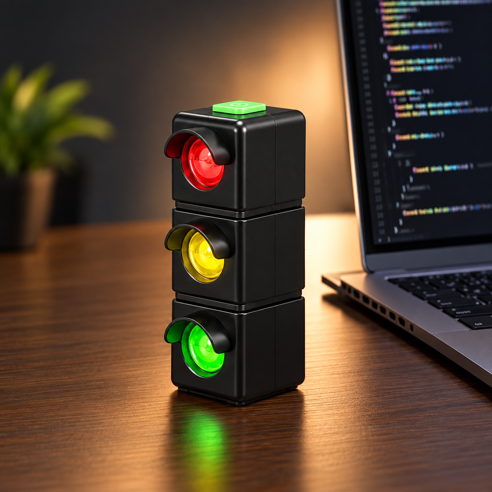
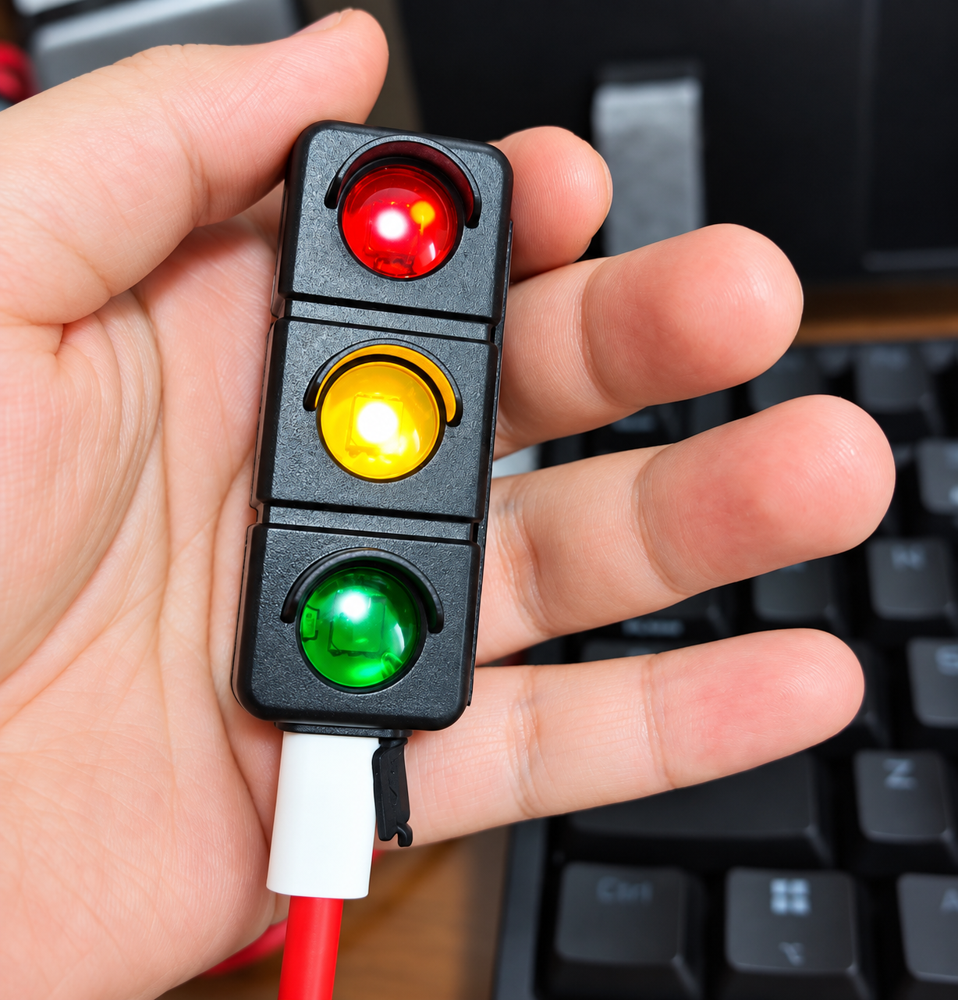
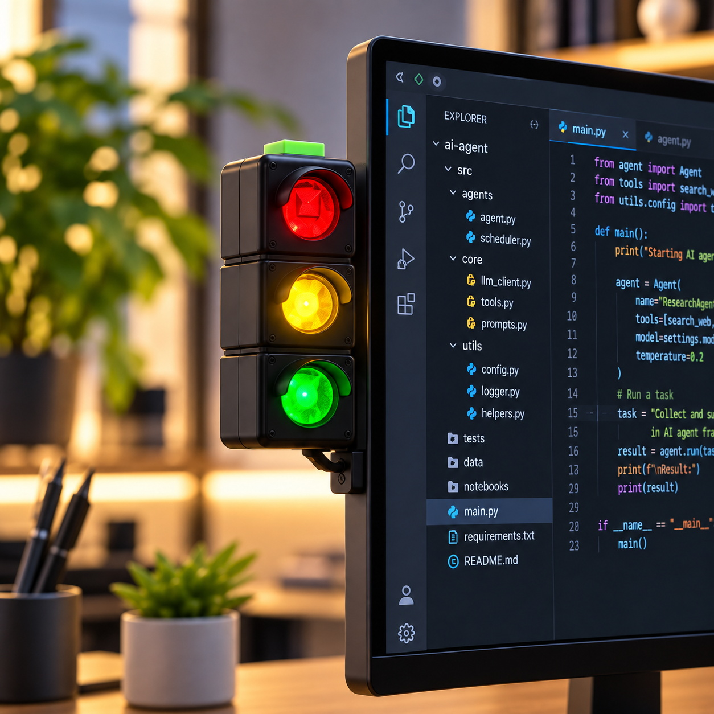
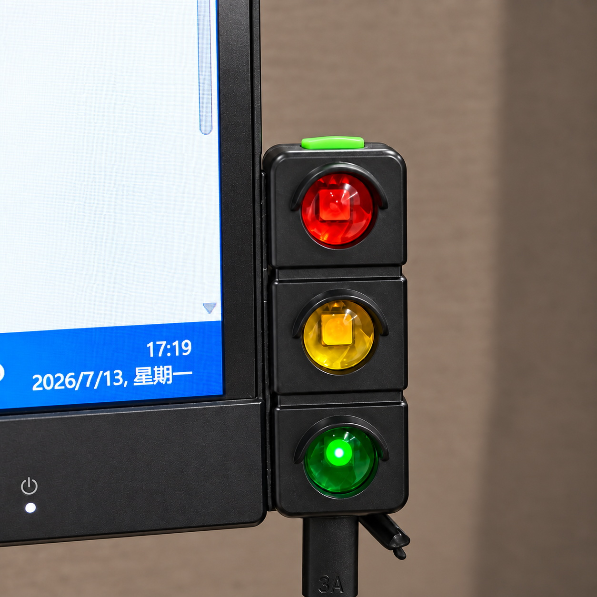
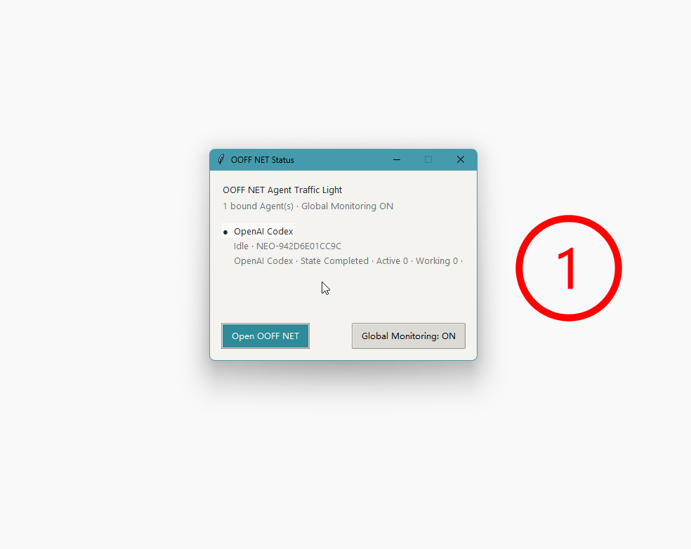
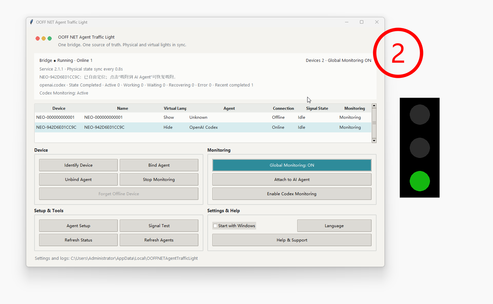
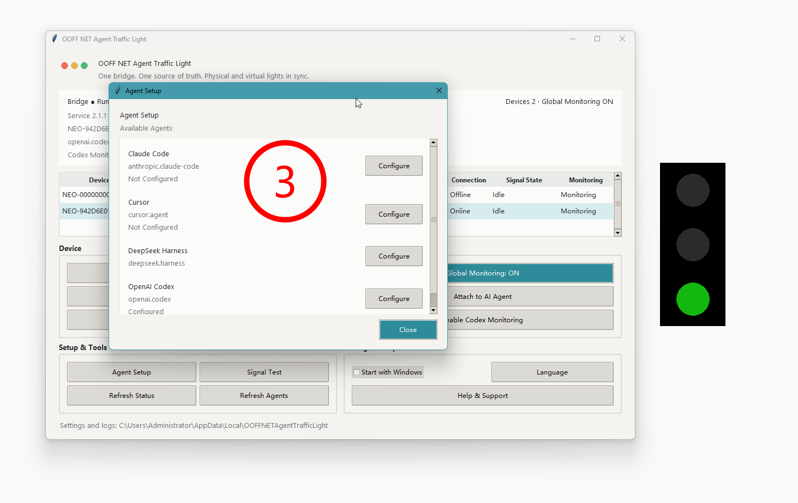
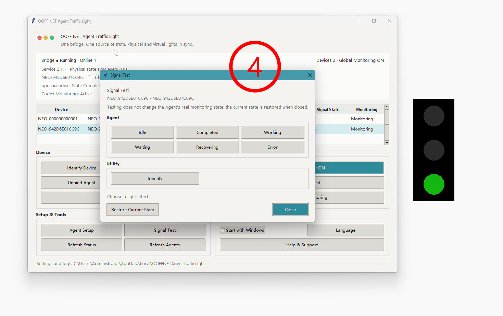
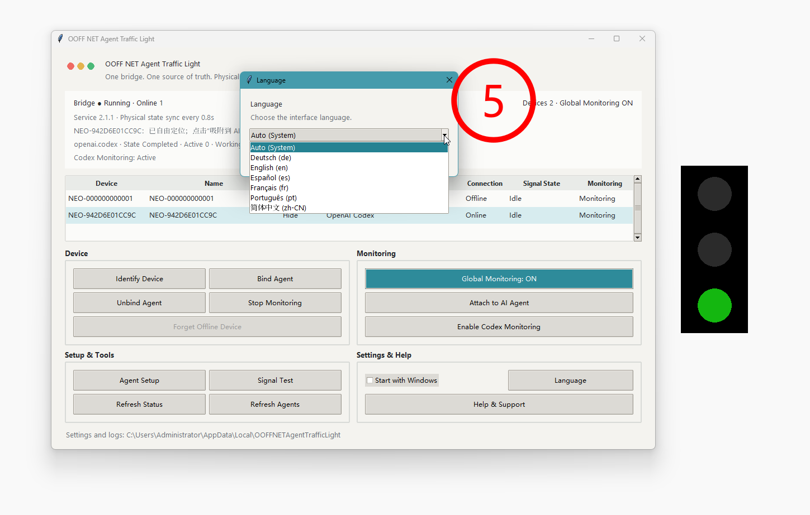
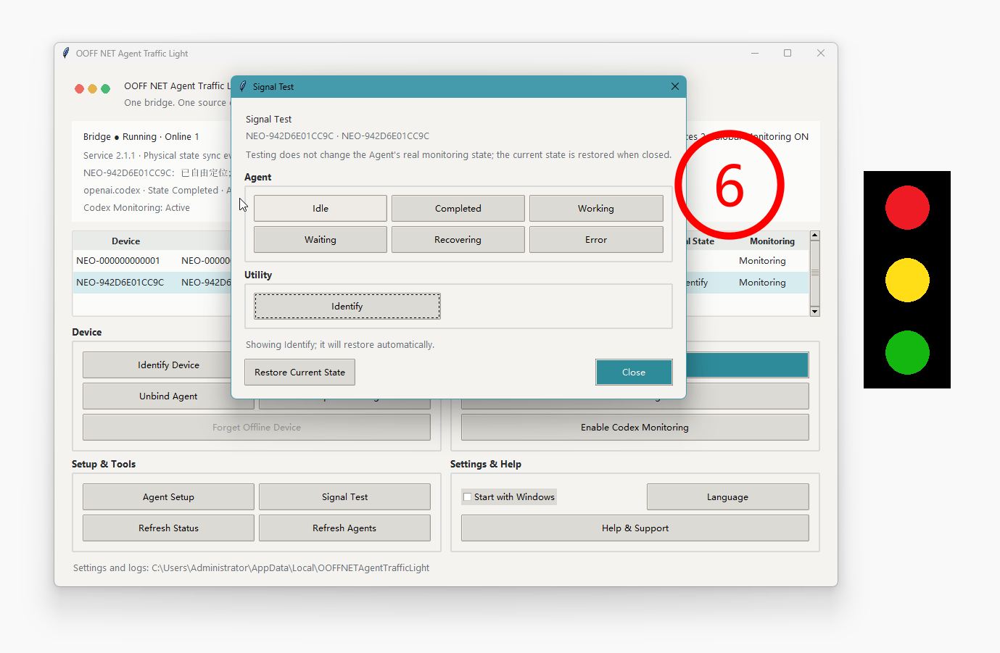

# OOFF NET — Physical Status Light for AI Agents

OOFF NET is a physical traffic light for AI-agent activity. It gives a quick,
at-a-glance indication of whether an agent is working, waiting for attention,
recovering, has completed a turn, or has reported an error.

> **One Agent. One Light. One Glance.**

## What it is

The OOFF NET Agent Status Light is a physical companion for AI coding agents.
An agent integration sends lifecycle state changes to the local OOFF NET
application, which presents the state on a USB-connected light.

The light is designed to answer one simple question without opening a terminal
or application window: **what does my agent need right now?**

## Production hardware

The photographed OOFF NET unit below is our current production hardware. It is
the physical product used to demonstrate the local Agent Status Light workflow.
Additional form factors and companion designs are still in development and
should not be read as released products.

| Desktop setup | Handheld view |
| --- | --- |
|  |  |

| Monitor-side setup | Production unit in use |
| --- | --- |
|  |  |

## Software workflow

These screenshots show the OOFF NET desktop application used to discover a
device, bind an Agent, configure monitoring, and verify signal states.

View setup and monitoring screenshots

## Status signals

| Agent state | Light signal | Meaning |
| --- | --- | --- |
| `IDLE` | Green steady | No active work is reported |
| `COMPLETED` | Green blinking | A turn has completed; the completion signal is being shown |
| `WORKING` | Yellow steady | The agent is actively working |
| `WAITING` | Yellow blinking | The agent is waiting for user input, permission, or another action |
| `RECOVERING` | Red steady | The agent is recovering from a transient problem |
| `ERROR` | Red blinking | The agent reported an error or requires attention |

The device also has hardware and communication signals. See
[`docs/STATUS-SIGNALS.md`](docs/STATUS-SIGNALS.md) for the complete public
signal reference.

## Compatibility

| Target | Status |
| --- | --- |
| Windows 10 / Windows 11 | ✅ Verified |
| OpenAI Codex | ✅ Verified |
| macOS | 🧪 Testing |
| Claude Code | 🧪 Testing |
| Cursor | 🧪 Testing |
| DeepSeek | 🧪 Testing |

These labels describe the current validation level, not a promise that every
version of an agent behaves identically. Read
[`docs/COMPATIBILITY.md`](docs/COMPATIBILITY.md) before building an adapter.

## Build an adapter

OOFF NET is intended to support independent adapters for AI agents. The public
integration contract is documented in
[`docs/INTEGRATION.md`](docs/INTEGRATION.md), with the state definitions in
[`docs/STATUS-SIGNALS.md`](docs/STATUS-SIGNALS.md).

The public contract is deliberately small: an adapter reports one of six
agent states and does not send prompts, responses, tool arguments, source
code, or credentials to OOFF NET.

## Languages

The OOFF NET application supports English, Deutsch, Español, Français,
Português, and 简体中文. The adapter contract is language-independent.

## Links

- Product site: <https://ooff.net/>
- Product information: <https://bbccdd.com/product/ooff-net-bbccdd-com-ai-agent-status-light-physical-traffic-light-for-ai-coding-agents/>
- Adapter integration guide: <https://bbccdd.com/uncategorized/808/ooff-net-ai-agent-integration-guide-build-your-own-adapter.html>
- Support: <https://bbccdd.com/contact-us>

## Privacy and scope

The public integration is local-first. It is designed to exchange lifecycle
metadata only. It does not require an OOFF NET cloud account for the local
adapter contract. See [`docs/PRIVACY.md`](docs/PRIVACY.md) for the supported
data boundary.

This repository contains public documentation and compatibility information.
It does not contain the OOFF NET production application, firmware, installer,
Bridge implementation, or private build system.

## Non-affiliation

OOFF NET is an independent product. Product and company names mentioned in
compatibility documentation belong to their respective owners. See
[`NOTICE.md`](NOTICE.md).
